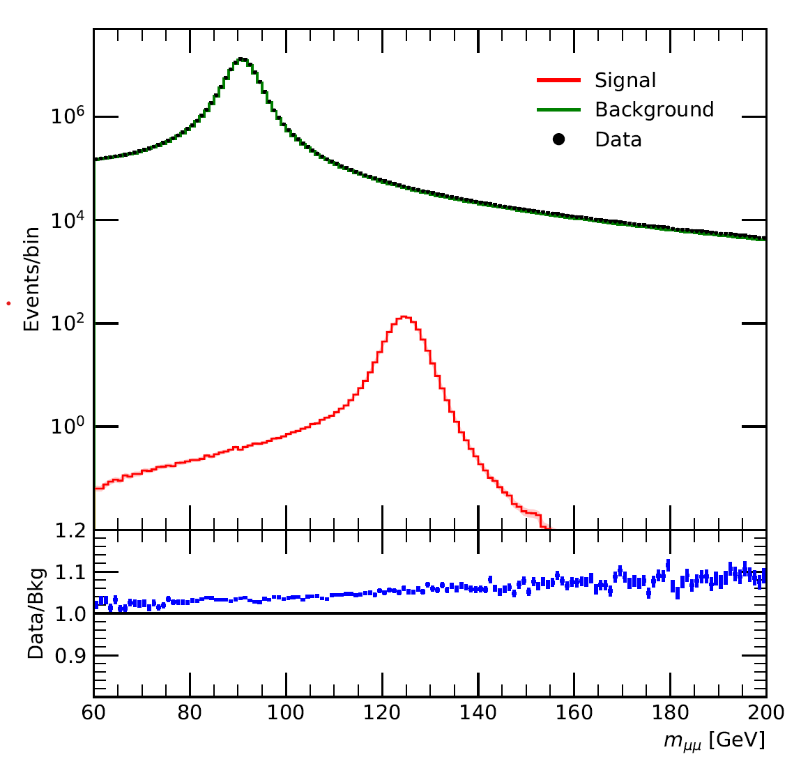

## Regression

In the first exercise, we aim to find the Higgs' boson signal from the vast amount of measurement data, 
which boils down to having to decide a suitable regression scheme (accurate, yet sufficiently regularized).

 

This exercise explored the following topics:
- Linear regression (least squares)
- Ridge Regression
- Support Vector Regression
- Kernel trick
- Gaussian Process Regression

**Disclaimer: For this particular exercise, most of the codes were provided by the assistants of the course.**